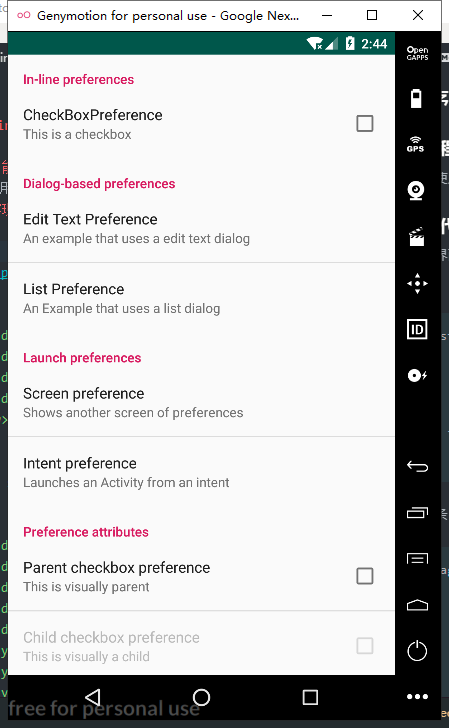
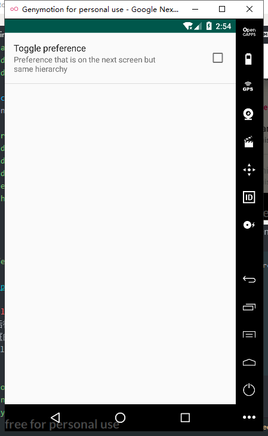
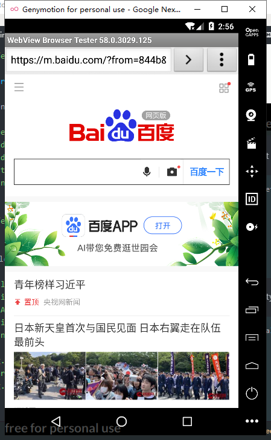

     

  
Screen preference：
```
 <PreferenceScreen
            android:key="Screen preference"
            android:title="Screen preference"
            android:summary="Shows another screen of preferences">
            <CheckBoxPreference
                android:key="Toggle preference"
                android:title="Toggle preference"
                android:summary="Preference that is on the next screen but same hierarchy" />
        </PreferenceScreen>
```
  

Intent preference：
```
<PreferenceScreen
            android:title="Intent preference"
            android:summary="Launches an Activity from an intent" >
            <intent
                android:action="android.intent.action.VIEW"
                android:data="http://www.baidu.com/"/>
        </PreferenceScreen>
  
Preference attrib
